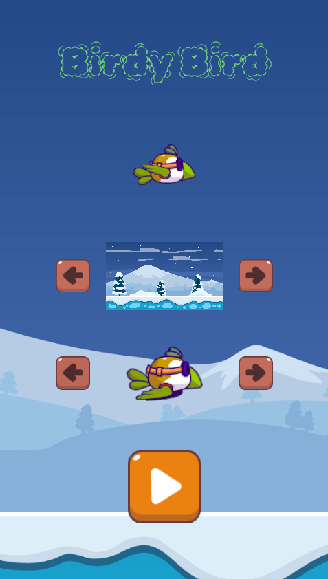
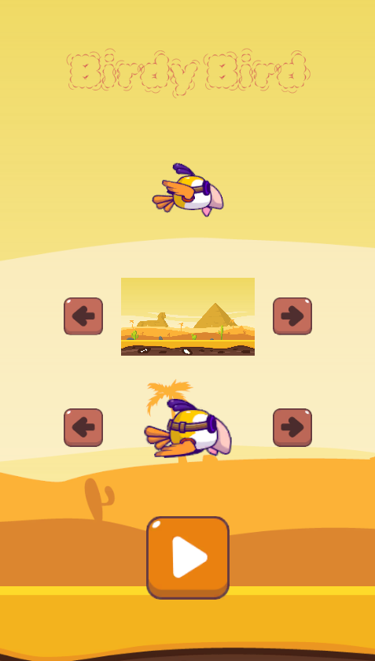
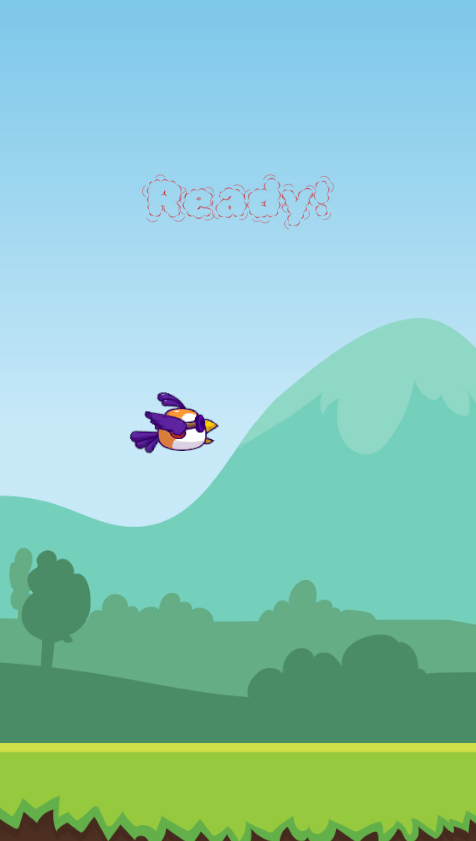
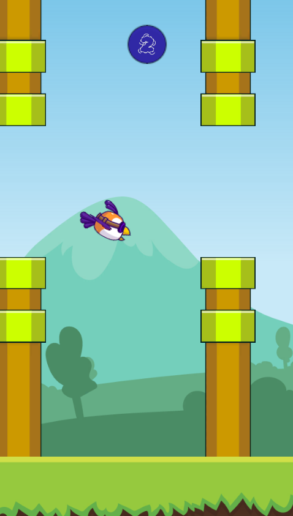
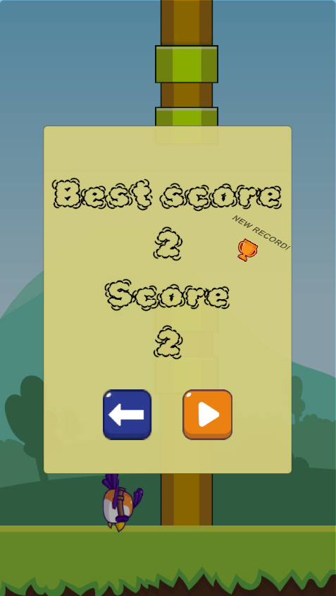

# 🐦 BirdyBird

A fast-paced Flappy Bird–style game where timing is everything.  
Simple controls, endless challenge.

## 🚀 Play the Game

👉 [BirdyBird WebGL](https://nicolas-mollo.itch.io/birdybird)

## 📥 Build Downloads

| Platform | Download |
|----------|----------|
| Android (ARMv7) | [BirdyBird.v.1.0](https://drive.google.com/drive/folders/1ODgVJwW0MB4H2_woEDk-YBJkpvN5UwkN?usp=sharing) |
| Android (ARM64) | [BirdyBird.v.1.0](https://drive.google.com/drive/folders/1JB4j6HIDGNKE0tVUB5HaLP8gqQvA_Vqk?usp=sharing) |
| Windows/Mac/Linux | [BirdyBird.v.1.0](https://drive.google.com/drive/folders/17G30FNN4252Q8sqQEUQurepHCdQf6GDK?usp=sharing) |

## 🚀 Run the Project Locally

1. Clone the repository:
   ```bash
   git clone https://github.com/NicolasMollo/BirdyBird.git
   ```
2. Open the project using Unity Hub
3. Open the project with version [Unity 22.3.62f3](https://unity.com/releases/editor/archive)
4. Press **Play** in the editor or build for your target platform

## 🛠️ Tech Stack

- Engine: **Unity**
- Language: **C#**

## 📸 Screenshot







